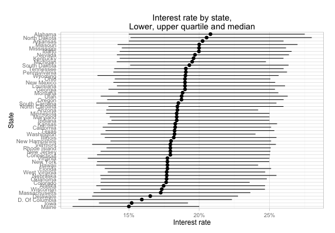
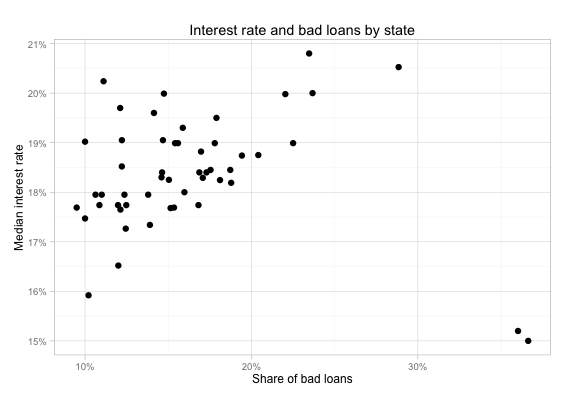
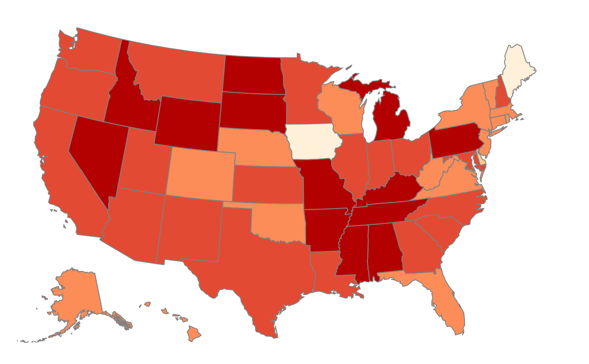

Summary
=====

This project is a grading project for a course 'Make Effective Data Visualization', a part of Udacity's nanodegree. I chose dataset with Loan Data from Prosper, suggested in the instructions to grading project. Focus of the writeup: relation between median interest rate in a state and share of bad loans. Findings: 

 * Interest rates vary little across the US states
 * Southern states have highest median interest rate
 * Share of bad loans highly correlate with interest rate in state
 * Two outlier states with high share of bad loans and low interest rate: Maine and Iowa.

The writeup is available on separate page, http://nikita-barsukov.github.io/data_vis_udacity/ 

Design
=======

When I started working on this project, at once I decided to use one of suggested datasets for my writeup. I used my own dataset in previous Udacity projects, and I spend several weeks in collecting and cleaning it up, obviously I did not want to spend so much time on tedious tasks again. 

Loans dataset was optimal choice. It wasn't too large, like PISA dataset, but it was complex enough. Also it looked like not many students used that dataset for the grading project. I also decided quickly to build my narrative around relationship between quality of loans and average interest rate, and create a story with several visualizations, not just single interactive plot.

The raw data file is 82MB, it contins data of individual loans. Since my focus was state level data, I used R scripts to aggregate data and to generate necessary CSV files that I used for my visualizations. These scripts are part of that repository. 

I did not use any Javascript framwork, like Backbone, or React, to organize my code. I simply splitted into several functions, each of these functions draws single visualization. Other choices of front-end libraries are very straightforward: d3.js for data visualization, Bootstrap 3 for layout, Underscore.js for array manipulation.

Feedback
=======

I started with generating plots in R:

And this is how first map plot looked like:

These plots immediately pointed several issues I had to address: 

* Tooltip explaining values of datapoints is necessary for scatterplot and map plot
* I need to find a balance in range plot: it shouldn't be too small, otherwise state labels would be crammed together into an unintelligible mess. It should also fit to a reasonably narrow screen, ex. my 13in macbook. 

Feedback about my visualization is collected on Udacity's discusion forum: https://discussions.udacity.com/t/feedback-on-grading-project-loan-data-from-prosper/158813 

Two people gave me constructive feedback. A reviewer suggested to add legend to the map plot. A fellow udacity student suggested adding regression line to scatterplot and pointed out several typos and mislabelled axes.

I added both legend to the map, and regression line to scatterplot. Regression line is calculated on datapoints excluding outlier states.

Resources
=======

Full list of resources used in this project are given in separate file [Sources.md](https://github.com/nikita-barsukov/data_vis_udacity/blob/master/Sources.md)
